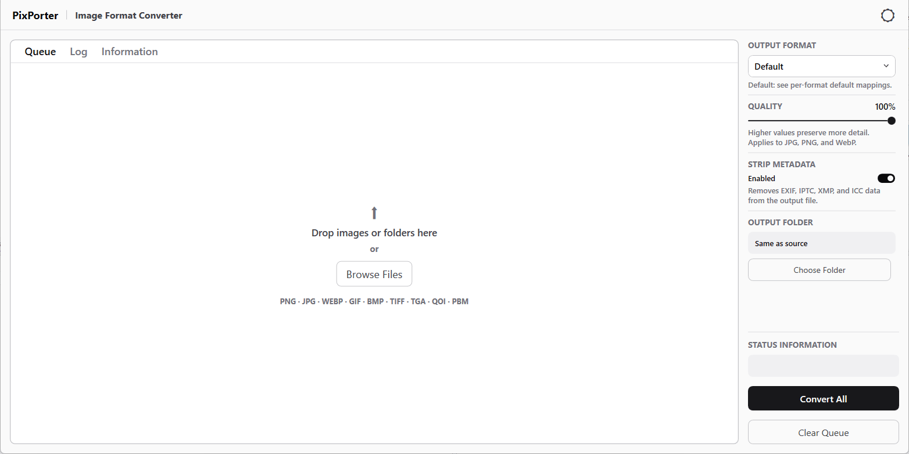

# PixPorter

A Windows desktop image converter. Drop files or folders in, pick a format, convert.



## What it does

- Converts between PNG, JPG, JPEG, WebP, GIF, BMP, TIFF, TGA, QOI and PBM.
- Takes drag-and-drop input, a file picker, or paths passed on the command line, so it works from "Open with" and "Send to".
- Dropping a folder queues every supported image inside it.
- Converts the whole queue in parallel, bounded to the processor count, and can be cancelled mid-run.
- Quality control for JPG, WebP and PNG. Formats that ignore quality say so rather than pretending to apply it.
- Optional metadata stripping, which clears EXIF, IPTC, XMP and ICC data.
- Writes output beside the source by default, or into a folder you choose.
- Per-file status, input and output sizes, and a log of every conversion with the path it wrote.
- Light and dark themes, following the system setting at startup.

## Default format mappings

When no output format is picked:

| Input | Output |
| --- | --- |
| `.webp` | `.png` |
| `.png` | `.webp` |
| `.jpg` / `.jpeg` | `.webp` |
| `.gif` | `.webp` |
| `.tiff` | `.webp` |
| `.bmp` | `.webp` |
| `.tga` | `.webp` |
| `.qoi` | `.webp` |
| `.pbm` | `.webp` |

## Quality

Quality applies to JPG, WebP and PNG output. For JPG and WebP it controls pixel fidelity, so lower values give smaller and lossier files. For PNG it maps to compression level only. PNG is always lossless and no pixel data is discarded at any setting.

## Not overwriting your originals

Two cases would otherwise destroy a source file, and both are handled by writing to a `-converted` suffix instead:

- Converting a file to the format it already is.
- Converting a batch that contains both `photo.png` and `photo.webp`, where the default mapping would make each one the other's output.

## Requirements

[.NET 10 SDK](https://dotnet.microsoft.com/download) and Windows. The UI is WPF, so it does not run on macOS or Linux.

## Build and run

```bash
git clone https://github.com/g-s-c-code/PixPorter.git
cd PixPorter
dotnet build PixPorter.WPF/PixPorter.WPF.csproj -c Release
```

The executable lands in `PixPorter.WPF/bin/Release/net10.0-windows/`.

For a self-contained build that runs without the .NET runtime installed:

```bash
dotnet publish PixPorter.WPF/PixPorter.WPF.csproj -c Release -r win-x64 --self-contained
```

Building the solution instead of the project will fail, because `PixPorter.wapproj` is a Windows Application Packaging project and needs full MSBuild from Visual Studio.

## Layout

| Project | Contents |
| --- | --- |
| `PixPorter.Common` | Conversion, format mapping, file discovery. No UI dependencies. |
| `PixPorter.WPF` | Views, view models, converters, theming. |
| `PixPorter` | Windows packaging project, Visual Studio only. |

The command line version lives in its own repository, [PixPorterCLI](https://github.com/g-s-c-code/PixPorterCLI).

## Open source

Image work is done by [SixLabors.ImageSharp](https://sixlabors.com/products/imagesharp/), a fully managed, cross-platform image processing library.

> Licensed under the Apache License 2.0. (c) Six Labors.

## Licence

MIT. See `LICENSE`.
